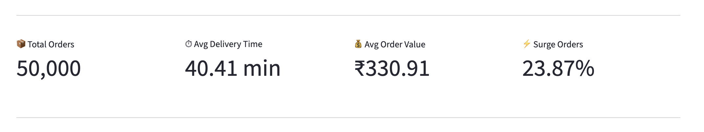
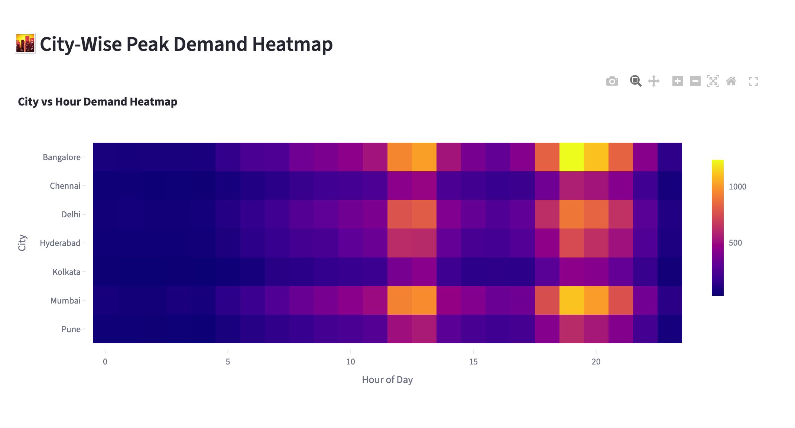
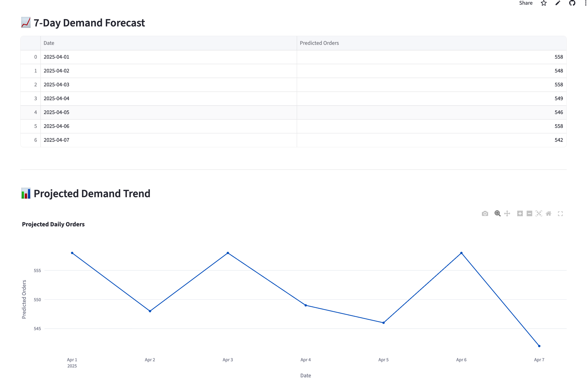

# Case 3: Food Delivery Demand Pulse

**Live demo:** https://case3-food-delivery-demand-pulse-9fpkaptmq5vyvjecwa963k.streamlit.app/
**Repo:** https://github.com/shiv1704/case3-food-delivery-demand-pulse.git
**Demo video:** will share

---

## What this is

A demand analytics and forecasting dashboard for a food delivery platform, built to surface demand spikes, surge inefficiencies, and operational bottlenecks across cities. Designed for operations and strategy teams who need to make rider allocation and pricing decisions backed by data.

---

## How to run locally

1. `git clone https://github.com/shiv1704/case3-food-delivery-demand-pulse.git`
2. `pip install -r requirements.txt`
3. `streamlit run app/streamlit_app.py`
4. Open http://localhost:8501

---

## Stack

- **Python** — primary language; well-suited for data pipelines and ML
- **Pandas** — data wrangling and aggregation across 50k orders
- **Plotly** — interactive charts without needing a separate frontend
- **Streamlit** — fastest path from notebook to shareable dashboard
- **Prophet** — out-of-the-box time-series forecasting with minimal tuning

---

## What's NOT done

- Real-time streaming ingestion — would require Kafka/Flink; out of scope for a static dataset
- Weather and traffic integration — no public API key available during build
- Cuisine-level forecasting — data too sparse at that granularity for reliable Prophet fits
- Rider-route optimization — needs geospatial data not present in the dataset

---

## In production, I would also add

- Live order ingestion via Kafka with a streaming aggregation layer
- Automated daily model retraining with drift detection
- SLA breach alerting tied to forecast confidence intervals
- Per-city model versioning and A/B evaluation pipeline
- Role-based access control for ops vs. executive views

---

## Dashboard Preview

### Main KPI

### Demand Heatmap

### Forecast Section

